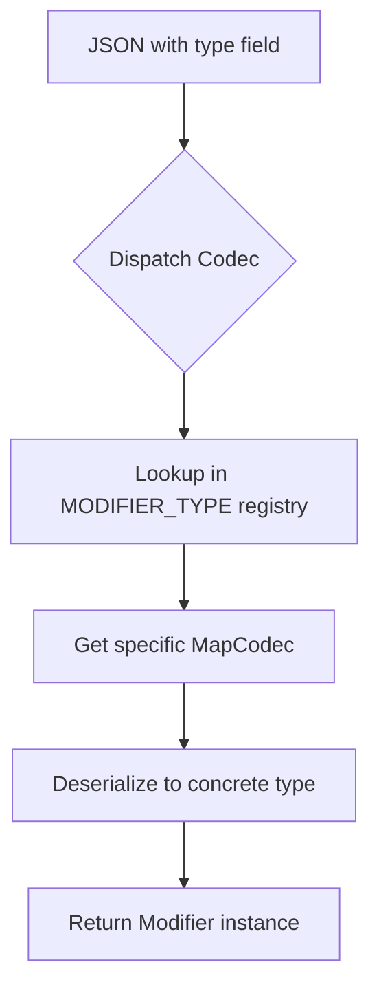

## Overview

Lithostitched extends Minecraft's registry system with custom registries for worldgen modifiers, surface rules, placement conditions, and more. This system uses Mojang's Codec API for serialization and type-safe registration.

<Info>
Custom registries allow Lithostitched to integrate seamlessly with Minecraft's data pack system while maintaining type safety and extensibility.
</Info>

## Registry Keys

All custom registries are defined in `LithostitchedRegistryKeys`:

```java /home/daytona/workspace/source/src/common/main/java/dev/worldgen/lithostitched/registry/LithostitchedRegistryKeys.java:20-36
public interface LithostitchedRegistryKeys {
    // Dynamic
    ResourceKey<Registry<Modifier>> WORLDGEN_MODIFIER = create("worldgen_modifier");
    ResourceKey<Registry<SurfaceRules.RuleSource>> SURFACE_RULE = create("surface_rule");
    ResourceKey<Registry<Bandlands>> BANDLANDS = create("bandlands");
    ResourceKey<Registry<TemplateList>> TEMPLATE_LIST = create("template_list");

    // Static
    ResourceKey<Registry<MapCodec<? extends Modifier>>> MODIFIER_TYPE = create("modifier_type");
    ResourceKey<Registry<MapCodec<? extends PlacementCondition>>> PLACEMENT_CONDITION_TYPE = create("placement_condition_type");
    ResourceKey<Registry<MapCodec<? extends ProcessorCondition>>> PROCESSOR_CONDITION_TYPE = create("processor_condition_type");
    ResourceKey<Registry<MapCodec<? extends Band>>> BANDLANDS_BAND_TYPE = create("bandlands_band_type");

    private static <T> ResourceKey<Registry<T>> create(String name) {
        return ResourceKey.createRegistryKey(Lithostitched.id(name));
    }
}
```

### Registry Types

<Tabs>
  <Tab title="Dynamic Registries">
    Dynamic registries store data-driven content loaded from JSON files in data packs:
    
    - **`WORLDGEN_MODIFIER`** - Individual modifier instances from JSON files
    - **`SURFACE_RULE`** - Named surface rule configurations
    - **`BANDLANDS`** - Bandlands biome definitions
    - **`TEMPLATE_LIST`** - Lists of structure templates
    
    <Note>
    Dynamic registry content can be changed by data packs without modifying code.
    </Note>
  </Tab>
  
  <Tab title="Static Registries">
    Static registries store type definitions (codecs) registered at mod initialization:
    
    - **`MODIFIER_TYPE`** - Modifier type codecs (e.g., `add_surface_rule`, `remove_structure_set_entries`)
    - **`PLACEMENT_CONDITION_TYPE`** - Placement condition type codecs
    - **`PROCESSOR_CONDITION_TYPE`** - Processor condition type codecs
    - **`BANDLANDS_BAND_TYPE`** - Bandlands band type codecs
    
    <Warning>
    Static registry content is defined in code and cannot be changed by data packs.
    </Warning>
  </Tab>
</Tabs>

## Registration Process

Types are registered during mod initialization through registration methods in the main `Lithostitched` class:

```java /home/daytona/workspace/source/src/common/main/java/dev/worldgen/lithostitched/Lithostitched.java:103-118
public static void registerCommonModifiers(BiConsumer<String, MapCodec<? extends Modifier>> consumer) {
    consumer.accept("internal/compile_raw_templates", CompileRawTemplatesModifier.CODEC);
    consumer.accept("add_processor_list_processors", AddProcessorListProcessorsModifier.CODEC);
    consumer.accept("add_structure_set_entries", AddStructureSetEntriesModifier.CODEC);
    consumer.accept("add_structure_templates", AddStructureTemplatesModifier.CODEC);
    consumer.accept("add_surface_rule", AddSurfaceRuleModifier.CODEC);
    consumer.accept("add_template_pool_elements", AddTemplatePoolElementsModifier.CODEC);
    consumer.accept("no_op", NoOpModifier.CODEC);
    consumer.accept("remove_structure_set_entries", RemoveStructureSetEntriesModifier.CODEC);
    consumer.accept("set_pool_aliases", SetPoolAliasesModifier.CODEC);
    consumer.accept("set_pool_element_processors", SetPoolElementProcessorsModifier.CODEC);
    consumer.accept("set_structure_spawn_condition", SetStructureSpawnConditionModifier.CODEC);
    consumer.accept("stack_feature", StackFeatureModifier.CODEC);
    consumer.accept("wrap_density_function", WrapDensityFunctionModifier.CODEC);
    consumer.accept("wrap_noise_router", WrapNoiseRouterModifier.CODEC);
}
```

### Registration Categories

Lithostitched provides registration methods for multiple categories:

<CardGroup cols={2}>
  <Card title="Modifiers" icon="gear">
    `registerCommonModifiers()`
  </Card>
  
  <Card title="Block Predicates" icon="cube">
    `registerCommonBlockPredicateTypes()`
  </Card>
  
  <Card title="State Providers" icon="random">
    `registerCommonStateProviders()`
  </Card>
  
  <Card title="Placement Modifiers" icon="location-dot">
    `registerCommonPlacementModifiers()`
  </Card>
  
  <Card title="Feature Types" icon="tree">
    `registerCommonFeatureTypes()`
  </Card>
  
  <Card title="Pool Elements" icon="puzzle-piece">
    `registerCommonPoolElementTypes()`
  </Card>
  
  <Card title="Density Functions" icon="wave-square">
    `registerCommonDensityFunctions()`
  </Card>
  
  <Card title="Structure Processors" icon="wrench">
    `registerCommonStructureProcessors()`
  </Card>
</CardGroup>

<Accordion title="View all registration methods">
```java Additional Registration Methods
// Block predicates
registerCommonBlockPredicateTypes(BiConsumer<String, BlockPredicateType<?>> consumer)

// State providers
registerCommonStateProviders(BiConsumer<String, BlockStateProviderType<?>> consumer)

// Placement modifiers
registerCommonPlacementModifiers(BiConsumer<String, PlacementModifierType<?>> consumer)

// Feature types
registerCommonFeatureTypes(BiConsumer<String, Feature<?>> consumer)

// Pool elements
registerCommonPoolElementTypes(BiConsumer<String, StructurePoolElementType<?>> consumer)

// Density functions
registerCommonDensityFunctions(BiConsumer<String, MapCodec<? extends DensityFunction>> consumer)

// Pool alias bindings
registerCommonPoolAliasBindings(BiConsumer<String, MapCodec<? extends PoolAliasBinding>> consumer)

// Structure types
registerCommonStructureTypes(BiConsumer<String, StructureType<?>> consumer)

// Placement conditions
registerCommonPlacementConditions(BiConsumer<String, MapCodec<? extends PlacementCondition>> consumer)

// Structure processors
registerCommonStructureProcessors(BiConsumer<String, StructureProcessorType<?>> consumer)

// Processor conditions
registerCommonProcessorConditions(BiConsumer<String, MapCodec<? extends ProcessorCondition>> consumer)

// Block entity modifiers
registerCommonBlockEntityModifiers(BiConsumer<String, RuleBlockEntityModifierType<?>> consumer)

// Surface rule sources
registerCommonRuleSources(BiConsumer<String, MapCodec<? extends SurfaceRules.RuleSource>> consumer)

// Surface conditions
registerCommonSurfaceConditions(BiConsumer<String, MapCodec<? extends SurfaceRules.ConditionSource>> consumer)

// Bandlands band types
registerCommonBandlandsBandTypes(BiConsumer<String, MapCodec<? extends Band>> consumer)
```
</Accordion>

## The Codec System

Lithostitched uses Mojang's Codec API for type-safe serialization and deserialization. Each registered type must provide a `MapCodec` that defines its JSON structure.

### Anatomy of a Codec

Here's how the `AddSurfaceRuleModifier` defines its codec:

```java /home/daytona/workspace/source/src/common/main/java/dev/worldgen/lithostitched/worldgen/modifier/AddSurfaceRuleModifier.java:18-23
public record AddSurfaceRuleModifier(int priority, List<ResourceKey<LevelStem>> levels, SurfaceRules.RuleSource surfaceRule) implements Modifier {
    public static final MapCodec<AddSurfaceRuleModifier> CODEC = RecordCodecBuilder.mapCodec(instance -> instance.group(
        PRIORITY_DEFAULT.forGetter(AddSurfaceRuleModifier::priority),
        ResourceKey.codec(Registries.LEVEL_STEM).listOf().fieldOf("levels").forGetter(AddSurfaceRuleModifier::levels),
        SurfaceRules.RuleSource.CODEC.fieldOf("surface_rule").forGetter(AddSurfaceRuleModifier::surfaceRule)
    ).apply(instance, AddSurfaceRuleModifier::new));
```

### Codec Components

<Steps>
  <Step title="RecordCodecBuilder">
    Creates a codec for record classes with named fields
  </Step>
  
  <Step title="Field Definitions">
    Each parameter maps to a JSON field:
    - `PRIORITY_DEFAULT.forGetter()` - Optional priority field with default value
    - `.fieldOf("field_name")` - Required field in JSON
    - `.optionalFieldOf("field_name", default)` - Optional field with default
  </Step>
  
  <Step title="Getters">
    `.forGetter()` specifies how to extract the value when encoding to JSON
  </Step>
  
  <Step title="Constructor Application">
    `.apply(instance, Constructor::new)` creates instances when decoding from JSON
  </Step>
</Steps>

### Example Codec Usage

This codec definition:

```java
RecordCodecBuilder.mapCodec(instance -> instance.group(
    Codec.INT.optionalFieldOf("priority", 1000).forGetter(MyModifier::priority),
    ResourceKey.codec(Registries.STRUCTURE).fieldOf("structure").forGetter(MyModifier::structure)
).apply(instance, MyModifier::new))
```

Maps to this JSON:

```json
{
  "type": "mymod:my_modifier",
  "priority": 1500,
  "structure": "minecraft:village_plains"
}
```

## Type Dispatch Codec

The `Modifier` interface uses a dispatch codec to determine which concrete type to deserialize based on the `type` field:

```java /home/daytona/workspace/source/src/common/main/java/dev/worldgen/lithostitched/worldgen/modifier/Modifier.java:23-28
Codec<Modifier> CODEC = Codec.lazyInitialized(() -> {
    var modifierRegistry = BuiltInRegistries.REGISTRY.getOptional(LithostitchedRegistryKeys.MODIFIER_TYPE.identifier());
    if (modifierRegistry.isEmpty()) throw new NullPointerException("Worldgen modifier registry does not exist yet!");
    return ((Registry<MapCodec<? extends Modifier>>) modifierRegistry.get()).byNameCodec();
}).dispatch(Modifier::codec, Function.identity());
```

<Info>
This dispatch codec looks up the appropriate concrete codec based on the `type` field in JSON, allowing polymorphic deserialization.
</Info>

### How Type Dispatch Works



## Creating Resource Keys

Lithostitched provides utility methods for creating resource keys:

```java /home/daytona/workspace/source/src/common/main/java/dev/worldgen/lithostitched/Lithostitched.java:77-83
public static <T> ResourceKey<T> key(ResourceKey<? extends Registry<T>> resourceKey, String name) {
    return ResourceKey.create(resourceKey, id(name));
}

public static Identifier id(String name) {
    return Identifier.fromNamespaceAndPath(MOD_ID, name);
}
```

### Usage Example

```java
// Create a resource key for a worldgen modifier
ResourceKey<Modifier> modifierKey = Lithostitched.key(
    LithostitchedRegistryKeys.WORLDGEN_MODIFIER,
    "my_custom_modifier"
);
// Results in: lithostitched:my_custom_modifier

// Create an identifier
Identifier id = Lithostitched.id("add_surface_rule");
// Results in: lithostitched:add_surface_rule
```

## Registry Access at Runtime

Modifiers can access registries during application through the `RegistryAccess` parameter:

```java
@Override
public void applyModifier(RegistryAccess registryAccess) {
    // Access the structure registry
    Registry<Structure> structures = registryAccess.registryOrThrow(Registries.STRUCTURE);
    
    // Access a Lithostitched registry
    Registry<SurfaceRules.RuleSource> surfaceRules = 
        Lithostitched.registry(registryAccess, LithostitchedRegistryKeys.SURFACE_RULE);
    
    // Use registries for your modifications
    // ...
}
```

## Best Practices

<CardGroup cols={2}>
  <Card title="Use RecordCodecBuilder" icon="code">
    Record classes with `RecordCodecBuilder` provide type-safe, concise codec definitions
  </Card>
  
  <Card title="Provide Defaults" icon="circle-check">
    Use `optionalFieldOf` with sensible defaults for optional fields
  </Card>
  
  <Card title="Lazy Initialization" icon="hourglass">
    Use `Codec.lazyInitialized()` to avoid circular dependency issues during registry creation
  </Card>
  
  <Card title="Consistent Naming" icon="tags">
    Follow Minecraft's naming conventions: lowercase with underscores
  </Card>
</CardGroup>

<Warning>
Avoid accessing registries in static initializers. Registries may not be fully initialized until runtime.
</Warning>

## Related Resources

<CardGroup cols={2}>
  <Card title="Modifiers" icon="gear" href="/concepts/modifiers">
    Learn about the Modifier interface
  </Card>
  
  <Card title="Data-Driven Config" icon="file-code" href="/concepts/data-driven-config">
    Write JSON configurations
  </Card>
</CardGroup>